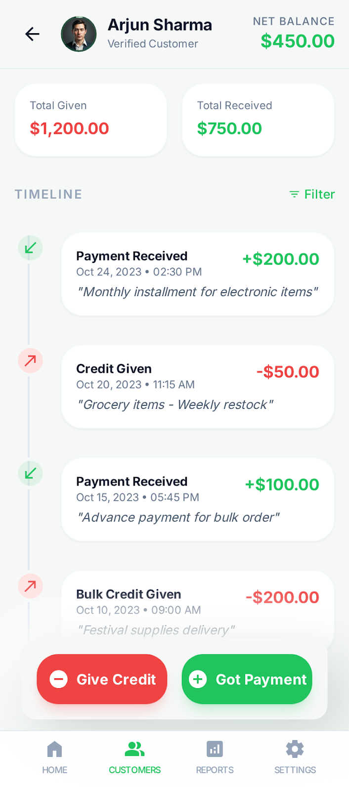

# Neu Khata

Neu Khata is a Flutter-based digital ledger app for small businesses. It helps manage customer balances, transactions, reminders, and reports with an offline-first architecture and a clean neumorphic UI.

## Features

- Customer management with individual ledgers
- Credit/debit transaction tracking
- Business registration flow before app dashboard access
- Reminder management (upcoming, overdue, settled)
- WhatsApp reminder sharing with auto-generated message
- Reports (weekly, monthly, yearly)
- Language support: English and Urdu
- Local data persistence using Isar database

## Screenshots

| Screen 1 | Screen 2 | Screen 3 |
| --- | --- | --- |
|  |  |  |

| Screen 4 | Screen 5 | Screen 6 |
| --- | --- | --- |
|  |  |  |

| Screen 7 | Screen 8 | Screen 9 |
| --- | --- | --- |
|  |  |  |

## Tech Stack

- Flutter + Dart
- Riverpod (state management)
- GoRouter (routing)
- Isar (local database)
- SharedPreferences (app settings)
- url_launcher (WhatsApp deep links)

## Folder Structure

```text
lib/
  core/
    theme/
    widgets/
  features/
    customers/
    dashboard/
    onboarding/
    reminders/
    reports/
    settings/
    splash/
    transactions/
  models/
  providers/
  router/
  main.dart
```

## Getting Started

### Prerequisites

- Flutter SDK (3.x)
- Android Studio and/or Xcode
- A connected emulator/device

### Install and Run

```bash
git clone <YOUR_REPOSITORY_URL>
cd neu_khata
flutter pub get
```

Generate model files (if needed):

```bash
dart run build_runner build --delete-conflicting-outputs
```

Run app:

```bash
flutter run
```

## Build Commands

Android debug assemble:

```bash
cd android
./gradlew :app:assembleDebug
```

Release APK:

```bash
flutter build apk --release
```

## Quality Checks

```bash
flutter analyze
flutter test
```

## Localization

- English (`en`)
- Urdu (`ur`)

Language can be changed from the Settings screen.

## Data Storage

All app data is stored locally on device using Isar. No cloud sync is configured by default.

## Contributing

1. Fork the repository
2. Create a feature branch
3. Commit changes
4. Open a pull request

## License

No open-source license is configured yet. Add a `LICENSE` file if you plan to publish publicly.
